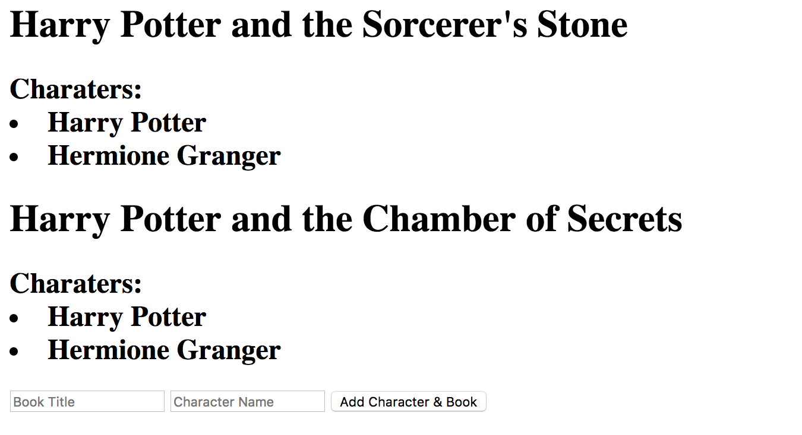
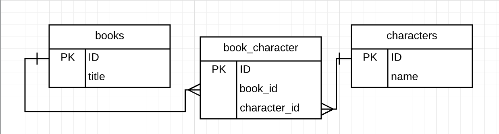

# Insert Exercise

## Set up:
- `npm install`
- `createdb insertTest`
- `knex migrate:latest`
- `knex seed:run`
- `nodemon`

Running on local host 3000 your site should look like this:


Your data looks like this:  


## Instructions:
Using this route as your guide:


```javascript
app.post('/add', (req, res) => {
  let bookTitle = {title: req.body.title}
  let characterName = {name: req.body.name}
  query.addBook(bookTitle)
  .then((data) => {
    let bookId = data
    query.addCharater(characterName)
    .then((data) => {
      let characterId = data
      query.addJoin(bookId, characterId)
      .then(() => {
        res.redirect('/')
      })
    })
  })
})
```

1. Update the addBook query to add a new book into the db if the book does not currently exist
1. Return the book id (existing id, or new if just created)
1. Update the addCharacter query to add a new character name into the db if the character does not currently exist
1. Return the character id (existing id, or new if just created)
1. Update the addJoin query to add a new relationship between book and character into the db if the relationship does not currently exist **this is why returning the book and character id is crucial**
------

## Examples:
- Submitting
`title: Harry Potter and the Chamber of Secrets,
name: Harry Potter`
    should result in 0 inserts

- Submitting
`title: Harry Potter and the Chamber of Secrets,
name: Luna`
  should result in 2 inserts (character and join)

- Submitting
`title: Harry Potter and the Half Blood Prince,
name: Ron`
  should result in 3 inserts (book, character and join)


------

## Tips:
- You will not need to change the **app.js, main.hbs or the getBooks query** to achieve this. You can place console.logs there to troubleshoot

- Use an if statement to determine if something **should** be added to the db
